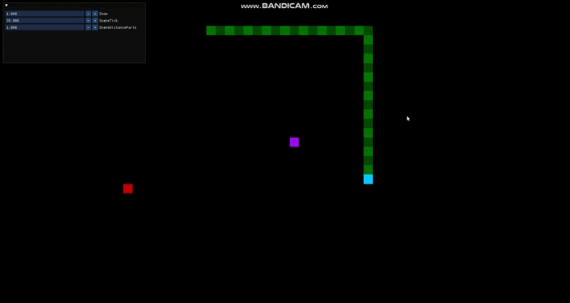

# LittleSnake!
This is a project where I will create a Snake Game, 2D as initial project and 3D if I do well. There's no much description, it is a Snake Game.

## About the Project
A simple Snake Game project, there's no much thing to say, is it; with a simple AI that chases the fruit, trying to steal from the player.

## Possible Features for the future
As the project grew I saw I couldn't finalize with all my initial plans, so I ended the scope to not stay stopped here. It was by my level in Graphics Programming, I am not able to create those things without using 99% of AI; in the future, when I have already learned it, I'll come back and put in hands this project and add all what I thought:
- Some maps and limited area with lava or something;
- Buttons that I would press and fall a bridge to you escape;
- A little lore that says why the snake is there;
- Different skins;
- Texture without crop in corners;
- And other things.

Is better end this game here and continuing learning and creating other games to come back with even more knowledge, if I stay here, I would skid.

## New Features since StarCollector
- Simple Chase AI
- Better Architecture
- New Entity Class Snake
- Added features to Object Class

## Technologies
- C++ 17
- OpenGL
- GLFW
- GLAD
- Dear ImGui
- GLM

## How to compile
1. Make sure I have MinGW-W64 and Make installed and setup in your computer.
2. Clone the repository.
3. Open the project in terminal and run make (or mingw-w64-make).
4. Enjoy!

## Ending
It was a good project, but there's no much thing to do, what I was thinking o create is over my knowledge, maybe, in the future, I come back to put all those things I was thinking. It was really simple.
